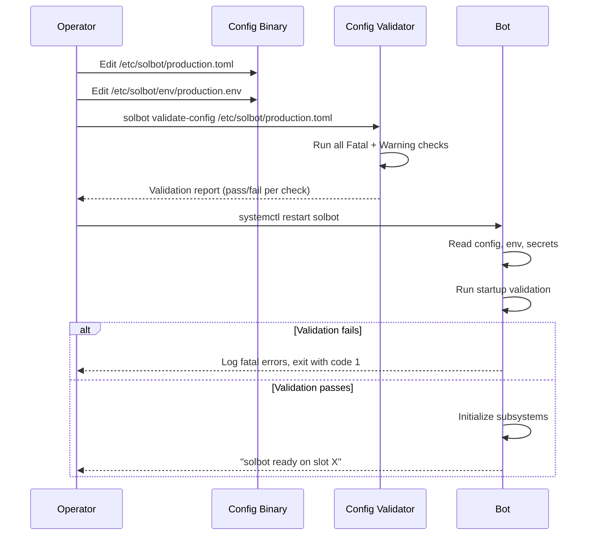
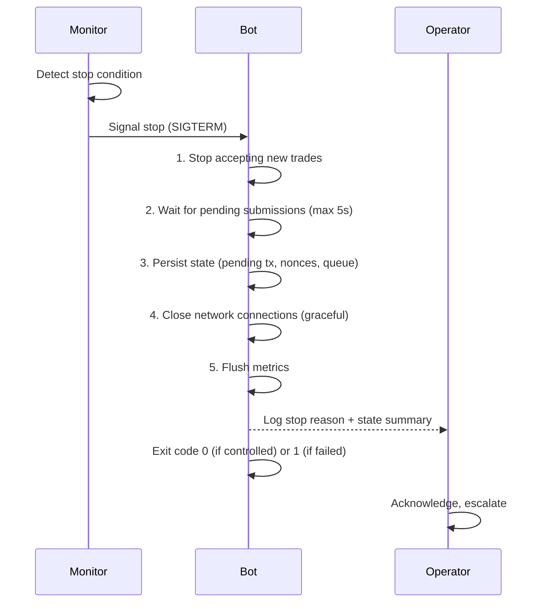

# Deployment Architecture — sol-trade-sdk

> **Reference**: Sections 40, 41, 42 of the pre-flight requirements
> **Scope**: Environment separation, systemd service, configuration pre-flight, production stop conditions
> **Status**: Design — implementation pending

---

## 1. Environment Separation

### Environment Matrix

| Environment | Network | Wallet | Risk Limits | Credentials | Metrics | Logs | Data Retention |
|-------------|---------|--------|-------------|-------------|---------|------|----------------|
| **development** | devnet / localnet | throwaway dev key | unlimited | dev keys, env vars | none | debug | 1 day |
| **test** | testnet / devnet | dedicated test key | capped at 1 SOL/day | CI secrets, env vars | structured (JSON) | debug | 7 days |
| **shadow-mainnet** | mainnet (read-only) | read-only observer | N/A (no signing) | read-only RPC | full event metrics | debug | 30 days |
| **canary-mainnet** | mainnet (live) | dedicated canary key | 0.1 SOL/tx, 5 SOL/day | limited, separate | full | info | 90 days |
| **production-mainnet** | mainnet (live) | primary trading key | configured per strategy | vault-encrypted | full | warn+ | 180 days |

### Configuration Sources
Every environment reads configuration from the following sources, in precedence order (later overrides earlier):
1. Default values compiled into the binary
2. `/etc/solbot/config.toml` (environment-specific base config)
3. `/etc/solbot/secrets.toml` (encrypted, restricted to root:root 0600)
4. Environment variables (prefix `SOLBOT_`)

### Separation Boundaries
- **Wallets**: Each environment uses independent keypairs; never shared
- **RPC endpoints**: Each environment has its own primary + failover RPC URLs
- **SWQOS providers**: Shadow uses no providers; canary and production use separate API keys
- **Monitoring**: Each environment reports to a separate metrics namespace
- **State**: Persistent state (pending tx, nonces, cache) stored in separate directories per environment
- **Network**: Environments are deployed on separate VPS instances (or at minimum, separate container namespaces)

---

## 2. Systemd Service Design

### 2.1 Dedicated User

```bash
# Create dedicated non-privileged user
sudo useradd --system --no-create-home --shell /sbin/nologin solbot
sudo usermod -aG solbot $USER  # For admin access to logs
```

### 2.2 Systemd Service Unit

```ini
# /etc/systemd/system/solbot.service
[Unit]
Description=Solana DEX Trading Bot (sol-trade-sdk)
After=network-online.target ntp.service
Wants=network-online.target
Documentation=https://github.com/0xfnzero/sol-trade-sdk

[Service]
Type=simple
User=solbot
Group=solbot

# Environment file — restricted 0600, root:solbot
EnvironmentFile=/etc/solbot/env/production.env

# Working directory
WorkingDirectory=/opt/solbot

# Executable
ExecStart=/opt/solbot/bin/sol-trade-bot run --config /etc/solbot/production.toml

# Graceful shutdown — SIGTERM → graceful stop within 30s, then SIGKILL
ExecStop=/opt/solbot/bin/sol-trade-bot stop
KillSignal=SIGTERM
TimeoutStopSec=30
KillMode=mixed
SendSIGKILL=yes

# Restart policy
Restart=on-failure
RestartSec=5
StartLimitBurst=3
StartLimitIntervalSec=60

# Resource limits
LimitNOFILE=1048576
LimitNPROC=65536
LimitCORE=0

# Memory limits
MemoryMax=8G
MemoryHigh=6G

# CPU — CPUAffinity set administratively after performance testing
# CPUAffinity=0-3

# Security hardening
NoNewPrivileges=yes
ProtectSystem=full
ProtectHome=yes
PrivateTmp=yes
PrivateDevices=yes
ProtectClock=yes
ProtectKernelTunables=yes
ProtectKernelLogs=yes
ProtectControlGroups=yes
CapabilityBoundingSet=
AmbientCapabilities=
RestrictNamespaces=yes
RestrictRealtime=no
LockPersonality=yes
MemoryDenyWriteExecute=yes
ProtectHostname=yes
RemoveIPC=yes

# Network
PrivateNetwork=no  # Requires network access for RPC, ShredStream, SWQOS

[Install]
WantedBy=multi-user.target
```

### 2.3 Environment File

```bash
# /etc/solbot/env/production.env
# Owner: root:solbot, Permissions: 0600
SOLBOT_CONFIG=/etc/solbot/production.toml
SOLBOT_RPC_PRIMARY=https://mainnet.rpc.example.com
SOLBOT_RPC_FALLBACK=https://mainnet.rpc2.example.com
SOLBOT_WALLET_KEYPAIR=/etc/solbot/secrets/wallet.key
SOLBOT_SWQOS_JITO_UUID=jito-uuid-here
SOLBOT_SWQOS_BLOXROUTE_TOKEN=bloxroute-token-here
SOLBOT_SWQOS_NEXTBLOCK_TOKEN=nextblock-token-here
SOLBOT_SWQOS_FLASHBLOCK_TOKEN=flashblock-token-here
SOLBOT_METRICS_ENDPOINT=http://localhost:9090/api/v1/write
SOLBOT_OTEL_ENDPOINT=http://localhost:4317
RUST_LOG=warn,sol_trade_sdk=info,solana_streamer=info
```

### 2.4 Logging Configuration
```bash
# /etc/systemd/journald@solbot.conf
# Route solbot logs to a dedicated journal namespace
[Journal]
Storage=persistent
MaxRetentionSec=180day
MaxFileSec=1week
SyncIntervalSec=5
Compress=yes
```

---

## 3. Configuration Pre-Flight

### 3.1 Typed Configuration Groups

```rust
/// Top-level configuration. Every field must be present and valid.
/// Startup validation ensures all groups are populated.
#[derive(Deserialize)]
pub struct SolbotConfig {
    /// Network configuration (cluster, commitment, timeout)
    pub network: NetworkConfig,
    /// RPC endpoints and connection pooling
    pub rpc: RpcConfig,
    /// ShredStream / gRPC event source
    pub shredstream: ShredStreamConfig,
    /// Supported DEX protocols and their addresses
    pub protocols: ProtocolsConfig,
    /// Transaction submission configuration (SWQOS providers)
    pub submission: SubmissionConfig,
    /// Wallet and key management
    pub wallet: WalletConfig,
    /// Blockhash caching and expiry
    pub blockhash: BlockhashConfig,
    /// Fee estimation and prioritization
    pub fees: FeesConfig,
    /// Risk management (position limits, rate limits, stop conditions)
    pub risk: RiskConfig,
    /// Trading strategy configuration
    pub strategy: StrategyConfig,
    /// Metrics, tracing, logging
    pub observability: ObservabilityConfig,
    /// Persistent state storage
    pub storage: StorageConfig,
    /// Failure recovery and resilience
    pub recovery: RecoveryConfig,
    /// Runtime tuning (CPU affinity, thread pool sizing, etc.)
    pub runtime: RuntimeConfig,
}
```

### 3.2 Startup Validation Checks

All configuration fields must pass validation before the bot starts. The validation sequence is:

```rust
pub struct ConfigValidator {
    checks: Vec<Box<dyn ConfigCheck>>,
}

pub trait ConfigCheck {
    fn name(&self) -> &'static str;
    fn severity(&self) -> Severity; // Fatal | Warning | Advisory
    fn check(&self, config: &SolbotConfig) -> Vec<ConfigIssue>;
}

pub enum Severity {
    Fatal,   // Block startup
    Warning, // Log and continue
    Advisory, // Log only
}
```

#### Validation Rules

| Group | Rule | Severity |
|-------|------|----------|
| `network` | Cluster URL is reachable and responds | Fatal |
| `network` | Commitment level is valid ('processed', 'confirmed', 'finalized') | Fatal |
| `network` | Timeout is between 100ms and 60s | Fatal |
| `rpc` | Primary RPC URL is valid URL and responds | Fatal |
| `rpc` | Fallback RPC URL is valid URL (if provided) | Warning |
| `rpc` | Rate limit is between 1 and 100,000 req/s | Fatal |
| `shredstream` | gRPC endpoint URL is valid and responds | Fatal |
| `shredstream` | Reconnect delay is between 100ms and 60s | Fatal |
| `shredstream` | Stale event threshold is between 100ms and 30s | Fatal |
| `protocols` | At least one protocol is enabled | Fatal |
| `protocols` | All protocol program IDs are valid base58 Pubkeys | Fatal |
| `protocols` | Protocol program IDs exist on the configured cluster | Warning |
| `submission` | At least one SWQOS provider is configured | Fatal |
| `submission` | Provider API keys/tokens are present and non-empty | Fatal |
| `submission` | Provider endpoints are valid HTTP(S) URLs | Fatal |
| `submission` | Max submission queue depth is between 1 and 10,000 | Fatal |
| `submission` | Confirmation timeout is between 1s and 120s | Fatal |
| `wallet` | Keypair file exists and is valid (64-byte ed25519) | Fatal |
| `wallet` | Keypair file permissions are 0600 or less permissive | Fatal |
| `wallet` | Wallet has non-zero SOL balance (production only) | Fatal |
| `wallet` | ATA accounts exist for all enabled protocols | Advisory |
| `blockhash` | Cache TTL is between 1s and 60s | Fatal |
| `blockhash` | Max cache entries is between 1 and 10,000 | Fatal |
| `blockhash` | Refresh interval is between half TTL and TTL | Fatal |
| `fees` | Base fee is between 0 and 1 SOL | Fatal |
| `fees` | Priority fee is between 0 and 1 SOL | Fatal |
| `fees` | Max fee cap is between base fee and 10 SOL | Fatal |
| `fees` | Fee multiplier is between 1.0 and 100.0 | Fatal |
| `risk` | Max position size is < wallet balance * 0.5 | Fatal |
| `risk` | Max trade value per unit time is configured | Fatal |
| `risk` | Cooldown between trades >= 0ms | Fatal |
| `risk` | Stop-loss pct between 0 and 100 | Fatal |
| `strategy` | At least one strategy is configured | Fatal |
| `strategy` | Each strategy references an enabled protocol | Fatal |
| `observability` | Metrics endpoint is valid URL (if configured) | Warning |
| `observability` | Log level is valid (trace/debug/info/warn/error) | Fatal |
| `observability` | OpenTelemetry endpoint is valid gRPC URL (if configured) | Warning |
| `storage` | State directory exists and is writable | Fatal |
| `storage` | Max state file size is between 1MB and 10GB | Fatal |
| `recovery` | Restart delay is between 1s and 300s | Fatal |
| `recovery` | Max restart attempts is between 0 and 100 | Fatal |
| `runtime` | Thread pool size is between 1 and num_cpus * 2 | Warning |
| `runtime` | CPU affinity mask is valid for this system | Advisory |
| `runtime` | Object pool sizes are between 1 and 10,000 | Fatal |

### 3.3 Configuration Lifecycle



---

## 4. Production Stop Conditions

### Reference: Section 46

The bot must stop immediately (graceful shutdown) when any of the following conditions are met. Stop conditions are evaluated on a dedicated monitoring tick and before every trade action.

### 4.1 Network / RPC Conditions

| # | Condition | Detection | Action |
|---|-----------|-----------|--------|
| 1 | RPC primary + all fallbacks unreachable for >N consecutive attempts (N configurable, default 3) | Health check loop | Immediate stop, log, alert |
| 2 | Blockhash service unavailable for >5s | Blockhash refresh timeout | Immediate stop, log, alert |
| 3 | Slot drift >5 slots from expected | ShredStream vs RPC comparison | Immediate stop, log |
| 4 | ShredStream disconnected with no reconnect within configured window | Connection state monitor | Immediate stop, log, alert |

### 4.2 Submission / SWQOS Conditions

| # | Condition | Detection | Action |
|---|-----------|-----------|--------|
| 5 | All SWQOS providers fail for >N consecutive submissions | Submission result monitor | Immediate stop, log, alert |
| 6 | Submission queue overflow (backpressure not clearing) | Queue depth monitor > threshold | Immediate stop, log |
| 7 | Confirmation timeout on >N consecutive transactions | Confirmation poller | Immediate stop, alert |
| 8 | Duplicate signature detected across providers | Reconciliation engine | Immediate stop, log, alert |

### 4.3 Financial / Risk Conditions

| # | Condition | Detection | Action |
|---|-----------|-----------|--------|
| 9 | Cumulative loss exceeds configured daily loss limit (default: 10% of wallet) | P&L tracker | Immediate stop, log, alert |
| 10 | Single trade loss exceeds configured max loss per trade | Trade result monitor | Immediate stop, log, alert |
| 11 | Wallet balance drops below minimum operating threshold | Balance monitor | Immediate stop, alert |
| 12 | Position limit exceeded for any token | Position tracker | Immediate stop, alert |

### 4.4 System Conditions

| # | Condition | Detection | Action |
|---|-----------|-----------|--------|
| 13 | Memory usage exceeds configured limit | cgroup OOM kill or internal monitor | Immediate stop, log, alert |
| 14 | Disk space for state/logs below 10% | Periodic statfs check | Immediate stop, alert |
| 15 | Clock skew >5s from NTP | Chrony/NTP monitor | Immediate stop, alert |
| 16 | Configuration file changed during runtime | inotify watch | Immediate stop, log |

### 4.5 Protocol Conditions

| # | Condition | Detection | Action |
|---|-----------|-----------|--------|
| 17 | IDL hash mismatch (protocol upgrade detected) | IDL hash check | Immediate stop, log, alert |
| 18 | simulateTransaction returns unexpected error on pre-flight | Pre-flight check | Immediate stop, alert |
| 19 | Unsupported token extension detected in hot path | Instruction builder | Stop that token, log, alert |

### 4.6 Security Conditions

| # | Condition | Detection | Action |
|---|-----------|-----------|--------|
| 20 | Secret/key exposure detected | Log scanning, external alert | Emergency stop, rotate keys, alert |
| 21 | Unauthorized access to config file | File integrity monitor | Emergency stop, alert |
| 22 | Sudden unexpected wallet activity | Balance change monitor | Emergency stop, alert |

### 4.7 Emergency Stop Procedure



### Configuration for Stop Conditions

```toml
[risk.stop_conditions]
rpc_unreachable_attempts = 3
blockhash_unavailable_ms = 5000
slot_drift_threshold = 5
swqos_fail_attempts = 3
submission_queue_overflow_threshold = 1000
confirmation_timeout_count = 3
daily_loss_limit_pct = 10.0
max_loss_per_trade_pct = 2.0
min_wallet_balance_sol = 0.5
disk_space_threshold_pct = 10.0
clock_skew_threshold_sec = 5
auto_restart_on_stop = false
```

### Stop Notification

Every stop condition triggers:
1. Structured log entry at ERROR level with stop condition details
2. Metrics counter increment (`solbot.stops.total`, `solbot.stops.<condition_name>`)
3. Alert to configured notification channel (Slack, PagerDuty, webhook)
4. Health check endpoint returns 503 with stop reason
5. If configured, automatic ticket creation (Opsgenie, service desk)